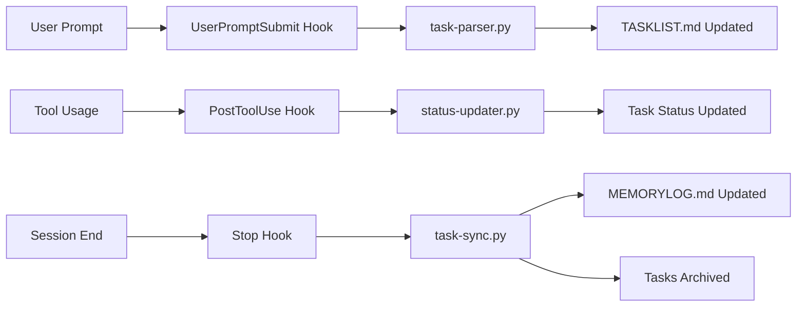

# Hook Integration Setup Guide
*Complete guide for activating Claude Code automation system*

## Quick Start

### 1. Verify File Structure
Ensure these files exist in your project:
```
CORE/
├── MEMORYLOG.md          # Project context and achievements
├── TASKLIST.md           # Living task tracker
├── HOOK_AUTOMATION.md    # System architecture documentation
└── HOOK_SETUP_GUIDE.md   # This guide

scripts/
├── task-parser.py        # Parses user requests for tasks
├── status-updater.py     # Updates task status based on tool usage
└── task-sync.py          # Synchronizes completed tasks

.claude/
└── settings.json         # Hook configuration
```

### 2. Test Hook System
Run these commands to verify functionality:

```bash
# Test task parser
echo '{"userPrompt": "Create a new login component"}' | python3 scripts/task-parser.py

# Test status updater
python3 scripts/status-updater.py --tool=write --file="src/components/Login.vue"

# Test synchronizer
python3 scripts/task-sync.py
```

### 3. Hook Activation
The hooks are automatically active when Claude Code runs in this project directory. Check `.claude/settings.json` for current configuration.

## How It Works

### Automatic Task Detection
When you write prompts like:
- "Please implement user authentication"
- "Fix the routing issue in the dashboard"
- "Create a responsive navigation component"

The system automatically:
1. **Parses** your request for actionable tasks
2. **Adds** them to TASKLIST.md with appropriate status and priority
3. **Updates** status as you work on files
4. **Synchronizes** completed work with MEMORYLOG.md

### Status Tracking
Tasks automatically progress through these states:
- `[ ]` **Pending** - Task identified but not started
- `[🔄]` **In Progress** - Files being modified related to task
- `[✓]` **Completed** - Work finished and verified
- `[❌]` **Blocked** - Issues preventing progress
- `[⏸️]` **Paused** - Temporarily on hold
- `[🔍]` **Under Review** - Awaiting feedback/testing
- `[📋]` **Planning** - Requirements being defined

## Configuration Options

### Hook Customization
Edit `.claude/settings.json` to modify hook behavior:

```json
{
  "hooks": {
    "UserPromptSubmit": [
      {
        "matcher": ".*",
        "hooks": [
          {
            "type": "command",
            "command": "python3 scripts/task-parser.py",
            "timeout": 10000
          }
        ]
      }
    ]
  }
}
```

### Task Parser Settings
Modify `scripts/task-parser.py` to adjust:
- **Task detection keywords** for different project types
- **Priority determination** based on language patterns
- **Task categorization** for better organization

### Status Update Rules
Customize `scripts/status-updater.py` to change:
- **File pattern matching** for task relevance
- **Status transition logic** based on tool usage
- **Completion detection** patterns

## Troubleshooting

### Common Issues

#### Scripts Not Executing
```bash
# Make scripts executable
chmod +x scripts/*.py

# Check Python path
which python3
```

#### Tasks Not Being Detected
1. Check if task contains action keywords: `implement`, `create`, `fix`, `build`
2. Verify TASKLIST.md is writable
3. Check script logs in Claude Code output

#### Status Not Updating
1. Verify file paths match task content
2. Check tool usage patterns in `status-updater.py`
3. Ensure hook configuration matches your workflow

#### Sync Issues
1. Check MEMORYLOG.md write permissions
2. Verify task completion patterns
3. Review archive section format

### Debug Mode
Add debug logging to any script:
```python
import logging
logging.basicConfig(level=logging.DEBUG)
```

### Manual Override
You can always manually edit TASKLIST.md and MEMORYLOG.md if automation needs adjustment.

## Best Practices

### Writing Effective Task Prompts
- **Be specific**: "Create user authentication component" vs "add auth"
- **Include context**: "Fix responsive navbar on mobile devices"
- **Specify priorities**: "Urgent: resolve production API timeout issue"

### Task Organization
- **Group related tasks** under feature headings
- **Use dependencies** to show task relationships  
- **Regular cleanup** of completed tasks to archive

### Monitoring Progress
- **Check TASKLIST.md** regularly for status overview
- **Review MEMORYLOG.md** for project achievements
- **Use completion rate** metrics for progress tracking

## Advanced Features

### Custom Task Templates
Create standardized task structures for common patterns:
```markdown
### Feature: User Authentication
- [ ] Design authentication flow
- [ ] Implement login component  
- [ ] Add session management
- [ ] Write authentication tests
- [ ] Update documentation
```

### Integration with External Tools
Extend hooks to integrate with:
- **Project management tools** (Jira, Trello)
- **CI/CD pipelines** for deployment tracking
- **Team communication** (Slack notifications)

### Analytics and Metrics
Track development patterns:
- **Task completion rates** over time
- **Most common task types** for process optimization
- **Development velocity** measurements

---

## System Architecture Summary



This system provides comprehensive automation while maintaining full control and visibility over your development process.